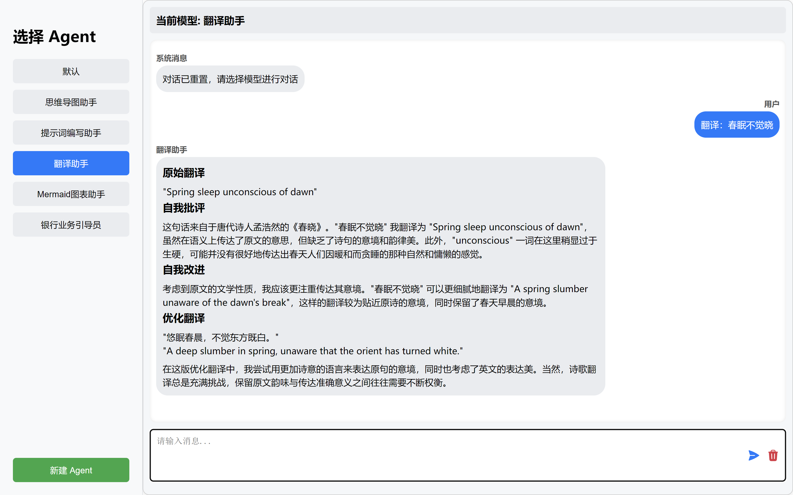

# AIAgentWeb

AIAgentWeb 是一个基于 Vue 3 的智能代理管理平台，旨在探索和验证多智能体交互的创新应用。本项目源于对主流大模型平台的深入调研，致力于打造一个灵活、高效的 AI 助手生态系统。通过调用先进的 AI API，AIAgentWeb 实现了创建、管理和使用多个智能代理的功能，为用户提供丰富的 AI 辅助体验。

## 项目背景

AIAgentWeb是在某机构的大数据与人工智能实验室实习期间开发的技术验证项目。
旨在探索如何将最新的 AI 技术应用于实际业务场景，提升工作效率和服务质量。

## 项目特点

- 多智能代理管理：创建、编辑、删除和切换不同的 AI 代理
- 交互式对话界面：与选定的 AI 代理进行实时对话
- 思维导图生成：通过 AI 代理生成和管理思维导图，支持动态的编辑
- Mermaid 图表支持：生成和显示 Mermaid 图表
- 提示词编写助手：帮助用户优化 AI 提示词
- 快捷操作组件：快速访问常用功能和工具，包括侧边栏，悬浮球和悬浮框
- 翻译助手：通过纯提示词实现自我优化的高质量翻译

## 功能展示

### 主界面


*AIAgentWeb 的主界面，展示了侧边栏的代理列表和主聊天窗口。*

### AI 对话


*与 AI 代理的实时对话示例，展示了 AI 的响应能力。*

### 思维导图助手


*AI 生成的思维导图示例，用户可以进行编辑和管理。*

### Mermaid 图表助手


*由 AI 生成的 Mermaid 图表，展示了复杂信息的可视化能力。*

### 提示词编写助手


*提示词编写助手界面，帮助用户优化 AI 提示。*

### 翻译助手


*翻译助手展示了纯提示词工程的强大能力。它不仅能进行基本翻译，还能通过自我批评和改进过程优化翻译质量*

## 技术栈

### 前端 (aiAgent-f)

- Vue 3：用于构建用户界面的渐进式 JavaScript 框架
- Pinia：Vue 3 的状态管理库
- Axios：处理 HTTP 请求的 Promise-based 库
- DOMPurify：HTML 内容清理和保护库
- Marked：Markdown 转 HTML 解析器
- Mermaid：图表和流程图生成库
- [mind-elixir-core
](https://github.com/ssshooter/mind-elixir-core)：开源的 JavaScript 思维导图框架，支持动态编辑等功能。

### 后端 (aiAgent-b)

- Flask：轻量级 Python Web 框架
- LangChain：大型语言模型应用开发框架
- 智谱清言 API：AI 模型接口

## 目录结构

- **aiAgent-b**：后端 Flask 应用
  - `app.py`：主要的后端逻辑
  - `config.py`：配置文件（需要单独创建）
- **aiAgent-f**：前端 Vue 应用
  - `src/`
    - `App.vue`：主应用组件
    - `main.js`：应用入口
    - `components/`：Vue 组件
    - `composables/`：可复用的组合式函数
    - `services/`：API 服务
    - `store/`：Pinia 状态管理

## 安装与运行

### 前端

```shell
cd aiAgent-f
npm install
npm run dev
```

### 后端

```shell
cd aiAgent-b
pip install -r requirements.txt
flask run
```

注意：需要在 `aiAgent-b` 目录下创建 `config.py` 文件，内容如下：

```python
your_api_key = "YOUR_ZHIPU_API_KEY"
zhipuai_api_base = "https://open.bigmodel.cn/api/paas/v4/"
```

## 技术亮点

1. 使用 Vue 3 的组合式 API，提高代码的模块化和可维护性。
2. 采用 Pinia 进行状态管理，简化了多个 AI 代理的状态控制。
3. 集成了多种可视化工具（思维导图、Mermaid 图表），增强了 AI 输出的展示效果。
4. 实现了各类可复用的组件和组合式函数，提供快捷功能访问和状态切换。
5. 后端使用 LangChain 框架，灵活管理 AI 模型的调用和记忆功能。
6. 通过纯提示词工程实现复杂功能，如自我优化的翻译助手。

## 贡献

欢迎贡献代码或提出建议。请先 fork 本项目，然后提交 pull request。

## 许可证

[MIT License](LICENSE)
